# LeadPilot 🚀
**The Autonomous B2B Lead Generation Engine**

LeadPilot is an AI-powered sales sniper that finds, filters, and personalizes outreach for high-ticket clients. It automates the tedious parts of lead generation so you can focus on closing deals.


---

## ✨ Features

*   **🕵️‍♂️ Multi-Source Scraping:**
    *   **Google Maps:** Finds businesses by city & category (e.g., "Dentists in London").
    *   **Instagram:** Finds specialized niches via hashtags/keywords (e.g., "interior designer dubai").
*   **🧠 Intelligent Filtering:**
    *   Automatically discards low-value leads (perfect rating + website = ignore).
    *   Prioritizes "Digital Misfits": Businesses with money but poor online presence.
*   **🤖 AI Outreach Agent:**
    *   Generates **hyper-personalized** DMs for every single lead.
    *   Uses real data (rating, review count, missing website) to write a hook that *actually* converts.
*   **⚡ Real-Time Dashboard:**
    *   Live progress tracking of scraping jobs.
    *   "Leads CRM" to manage status (New -> Contacted -> Closed).
    *   Batch processing queue for bulk operations.

---

## 🏗️ Architecture

LeadPilot uses a modern, decoupled architecture designed for scale.

```mermaid
graph TD
    User(👤 User) --> Frontend(Next.js Dashboard)
    Frontend -->|API Requests| Backend(FastAPI Server)
    
    subgraph "Backend Infrastructure"
        Backend --> DB[(SQLite / Postgres)]
        Backend -->|Queue| BgTasks[Background Workers]
    end
    
    subgraph "External Services"
        BgTasks -->|Scrape| Apify(Apify Actors)
        BgTasks -->|Enrich| Gemini(Google Gemini AI)
    end
```



*   **Frontend:** Next.js 14, TypeScript, Tailwind CSS
*   **Backend:** FastAPI (Python), SQLAlchemy, Pydantic
*   **Database:** SQLite (Local) / PostgreSQL (Production)
*   **AI Engine:** Google Gemini Pro
*   **Scraping Provider:** Apify

---

## 🛠️ Local Setup

### Prerequisites
*   Node.js 18+
*   Python 3.9+
*   Git

### 1. Clone the Repository
```bash
git clone https://github.com/Rishet11/LeadPilot.git
cd LeadPilot
```

### 2. Backend Setup
```bash
# Create virtual environment
python -m venv venv
source venv/bin/activate  # Windows: venv\Scripts\activate

# Install dependencies
pip install -r requirements.txt

# Create .env file
cp .env.example .env
# Edit .env and add your API keys (Apify, Gemini)
```

### 3. Frontend Setup
```bash
cd frontend

# Install dependencies
npm install

# Create local env file
cp .env.example .env.local
# Set NEXT_PUBLIC_API_URL=http://localhost:8000
```

### 4. Run It 🚀
You need two terminals:

**Terminal 1 (Backend):**
```bash
# Run from root directory
uvicorn api.main:app --reload
```

**Terminal 2 (Frontend):**
```bash
cd frontend
npm run dev
```

Visit **http://localhost:3000** to see the dashboard!

---

## 🚢 Production Deployment

LeadPilot is optimized for **Railway** (Backend) and **Vercel** (Frontend).

### Phase 1: Backend (Railway)
1. Fork this repo.
2. Login to [Railway.app](https://railway.app).
3. Create new project from GitHub repo.
4. Add Environment Variables:
    *   `LEADPILOT_API_KEY`: (Generate a secure random string)
    *   `APIFY_API_TOKEN`: Your Apify key
    *   `GEMINI_API_KEY`: Your Google AI key
    *   `ALLOWED_ORIGINS`: `https://your-vercel-app.vercel.app`
5. Railway will auto-deploy using `railway.toml`.

### Phase 2: Frontend (Vercel)
1. Login to [Vercel.com](https://vercel.com).
2. Create new project from GitHub repo.
3. Set **Root Directory** to `frontend`.
4. Add Environment Variables:
    *   `NEXT_PUBLIC_API_URL`: Your Railway URL (e.g., `https://web-production.up.railway.app`)
    *   `NEXT_PUBLIC_API_KEY`: The same key from Phase 1.
5. Deploy!

---

## 🔒 Security

*   **API Key Auth:** All backend endpoints are protected by `X-API-Key`.
*   **Rate Limiting:** Built-in throttling to prevent abuse and save API credits.
*   **CORS:** Strict origin policies in production.

---

## 🤝 Contributing

1. Fork the repo.
2. Create a feature branch (`git checkout -b feature/amazing-feature`).
3. Commit your changes.
4. Open a Pull Request.

---

**Built by [Rishet Mehra](https://github.com/Rishet11)**
